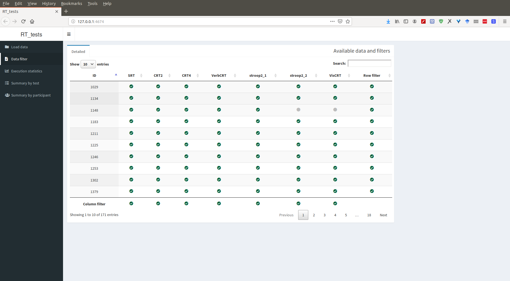

<link rel="stylesheet" href="css/bootstrap.min.css">
<link rel="stylesheet" href="css/style.css">

```{r setup, include=FALSE}
knitr::opts_chunk$set(echo = FALSE)

library('kableExtra')
library('dplyr')
library('EZ2')
library('stringr')
library('Hmisc')
library('prettydoc')
```

## Specifications of *RT_tests* battery

### *RT_tests* application

*RT_tests* is a Python-based tool for offline cognitive assessment. It is an autonomous framework that allows running cognitive tests on any computer that supports PsychoPy and performing cognitive assessment with minimal involvement of a tester. This framework was used to develop a test battery to measure individual differences in mental speed in children and adolescents. This test battery included six tests:

1. **SRT**: Simple Reaction Time. Participant has to respond to a stimulus that appears on the screen by pressing the key.
2. **CRT2**: Choice Reaction Time, 2 stimuli. Participant has to respond to a stimulus that appears on the screen in two alternative positions.
2. **CRT4**: Choice Reaction Time, 4 stimuli. Same as CRT2, stimulus appears in four alternative positions.
3. **VerbCRT**: Verbal Classification Task. Participant has to classify a word on the screen as plant or animal.
4. **stroop2_1**, **stroop2_2**: Stroop Task, 2 colors. Participant has to reply whether a word (XXXXXXX in stroop2_1 and 'red' or 'green' in stroop2_2) is red or green.
5. **VisCRT**: Visual Classification Task. Participant has to compare two stimuli on the screen by either shape or color, depending on the cue (word 'shape' or 'color').

Additionally, three tests were developed but not included in the battery used for the pilot data collection: Stroop Task with three colors and SRT and CRT2 with release response (Jensen paradigm).

Each test in the battery includes instruction (with demonstration of test screen and rules), training series and one or more assessment series.
Here are the screenshots of instruction and training screens for VisCRT test:


The series are presented sequentially and trial parameters are pooled from each series randomly using standard PsychoPy tools. Following mechanisms were implemented to ensure validity of the data:

+ Participant does not proceed to main series if training series was not completed with sufficient accuracy. For each test, minimum and maximum training trials are defined.
+ In each trial, the battery waits for the response until the non-response time limit is expired. If participant do not give a response by then, the nonresponse recorded.
+ If participant's accuracy is too low, the battery interrupts execution and shows the instruction screen again. The execution of a test interrupts completely if participant watched instruction three times and failed to maintain required accuracy.
+ The battery pauses the execution periodically to let participant have a short break.
+ Battery's actions and participant's responses are logged.

Test parameters (default value in parentheses):

+ `trial_dict`: a dictionary describing the mapping between stimuli and responses for each series. The app expects at least two series: training and main. As an example, this is a trial dictionary used for Stroop task (stroop2_2):
```{python trial_dict, eval = FALSE, echo = TRUE}
    trial_dict = OrderedDict(
        [('training', [{'word': u'КРАСНЫЙ', 'color': 'red',   'cor_resp': 'd', 'type': 'congr'},
                       {'word': u'ЗЕЛЁНЫЙ', 'color': 'green', 'cor_resp': 'l', 'type': 'congr'},
                       {'word': u'КРАСНЫЙ', 'color': 'green', 'cor_resp': 'l', 'type': 'incongr'},
                       {'word': u'ЗЕЛЁНЫЙ', 'color': 'red',   'cor_resp': 'd', 'type': 'incongr'}]),
         ('main',     [{'word': u'КРАСНЫЙ', 'color': 'red',   'cor_resp': 'd', 'type': 'congr'},
                       {'word': u'ЗЕЛЁНЫЙ', 'color': 'green', 'cor_resp': 'l', 'type': 'congr'},
                       {'word': u'КРАСНЫЙ', 'color': 'green', 'cor_resp': 'l', 'type': 'incongr'},
                       {'word': u'ЗЕЛЁНЫЙ', 'color': 'red',   'cor_resp': 'd', 'type': 'incongr'}])])

```
Trial dictionary is an ordered dictionary. Each trial is a dictionary that may include any number of entries. Among all, 'cor_resp' (the key that corresponds to correct response) is the only obligatory entry as it is used by the app to decide whether the response was correct. Other entries are used to render stimuli ('word' and 'color' in the example). Trial dictionary might also contain auxilary information about trial that wouldn't be used in the workflow but will be recorded in the output table and will assist further analysis. In the example, 'type' is such entry.

Here is an example of the data obtained using stroop2_2:
```{r stroop_data, results = 'asis'}
library(DT)

data <- read.csv2('stroop2_2.csv', 
                  header = TRUE, row.names = NULL, 
                  stringsAsFactors = FALSE)
names(data) <- names(data)[-1]
data <- data[-ncol(data)]
data$latency <- as.numeric(data$latency)
data$n <- as.numeric(data$n)
data$trial <- as.numeric(data$trial)

datatable(data, class = 'compact', rownames = FALSE,
          options = list(ordering = FALSE,
                         searching = FALSE)) %>%
  formatRound('latency', 3)
```

+ `nreps` (= 75): number of times each trial from trial dictionary will be repeated.

+ `maxtrials` (= 10000 trials): maximum number of trials.

+ `mintrain` (= 5 trials): minimum number of trials in training series before proceeding to main series.

+ `maxtrain` (= 20 trials): maximum numner of trials in training series. The test is interrupted when participant fails to complete training series with required accuracy.

+ `mincorrect` (= 0.7): minimum allowed percent of correct responses in main series. Also, minimum accuracy required in training series to proceed to main series. When participant fails to maintain the required level of accuracy, the app interrupts execution and shows instruction screen, then the execution is resumed. If participant was shown with the instruction screen three times and still fails to maintain the required level of accuracy, the app interrupts current test and proceedes to the next one. Also, the minimal accuracy limit does not come to effect until participant makes at least maxinvalidstrike trials.

+ `maxinvalidstrike` (= 10 trials): maximum number of consecutive invalid responses before the test interrupts. This rule was introduced to interrupt test execution when participant cannot respond for some reason.

+ `nonresptime` (= 3 sec): the limit on waiting time after the app shows stimulus on the screen. If waiting time expires, the app records non-response and proceeds to the next trial.

+ `breaktrials` (= 40 trials): the number of consecutive trials before the app gives participant a break.

+ `breaktime` (= 6 sec): duration of a break.

+ `interruptkey` (= 'y'): the key that can be used to interrupt execution in case of emergency. However, the interruption key works only during the breaks.

Each parameter can be set globally (same value for all tests) or locally (specific value for a specific test). For example, I allowed more trials in training series in more difficult tasks. 

In a pilot study, minumal accuracy (mincorrect), maximal sequence of invalid trials (maxinvalidstrike), periodicity of breaks (breaktrials) and break duration (breaktime) were set to default values. Other parameters were set specifically for each task:


```{r test_specifications, results = 'asis'}
matrix(c(
  c(80, 80, 80, 120, 80, 80, 96),
  c('5-20', '7-20', '7-20', '12-30', '12-30', '12-30', '12-30'),
  c(3, 3, 3, 5, 5, 5, 7)),
  ncol = 3,
  dimnames = list(c('SRT', 'CRT2', 'CRT4', 'VerbCRT', 'stroop2_1', 'stroop2_2', 'VisCRT'),
                  c("Trials in main series", 
                    paste0("Trials in training series", footnote_marker_number(1)), 
                    paste0("Non-response time limit (sec)", footnote_marker_number(2))))) %>%
  kable(align = 'c', escape = FALSE, caption = 'Test specifications') %>%
  kable_styling(bootstrap_options = c('striped', 'hover'))
```
<tfoot><sup>1</sup> mintrain-maxtrain; <sup>2</sup> nonresptime</tfoot>
<br>

In *RT_tests*, a test is implemented as an instance of general class that contains general methods, such as pooling trials, starting and finishing trials and recodring responses. For this reason the user does not have to implement all these things from scratch (or even copy-paste) to develop a new test. The user has to provide trial dictionary, mapping between trial data and stimuli appearing on the screen, general appearance of test screen and training screen. The user also alters test specifications. As an example, here is an inplementation of CRT2:

```{python, echo = TRUE, eval = FALSE}
#!/usr/bin/env python
# -*- coding: utf-8 -*-

from CogTest import CogTest, GoOn
from psychopy import visual
from collections import OrderedDict
from random import choice
import os


class CRT2 (CogTest):
    name = 'CRT2'
    nreps = 20         # number of repeats within each trial dictionary

    mintrain = 7       # minimum number of training trials
    maxtrain = 20      # maximum number of training trials

    # This is trial dictionary passed to data.TrialHandler
    # Must contain training series
    # Each series must contain 'cor_resp' which is correct response
    # (key on a keyboard)
    trial_dict = OrderedDict(
        [('training', [{'target': 'left', 'cor_resp': 'd'},
                       {'target': 'right', 'cor_resp': 'l'},
                       {'target': 'left', 'cor_resp': 'd'},
                       {'target': 'right', 'cor_resp': 'l'}]),
         ('main',     [{'target': 'left', 'cor_resp': 'd'},
                       {'target': 'right', 'cor_resp': 'l'},
                       {'target': 'left', 'cor_resp': 'd'},
                       {'target': 'right', 'cor_resp': 'l'}
                       ])])

    # You are welcome to change this for CogTest instances
    # Here you define all test stimuli
    # The fixation stimulus must be present
    def init_trial_stimuli(self):
        self.trial_stimuli = {
            # Fixation stimulus indicating start of the trial
            'fixation':
                visual.ShapeStim(self.test_screen, units=None, lineWidth=4,
                                 pos=[0, 0], lineColor='white',
                                 closeShape=False,
                                 vertices=((0, -10), (0, 10), (0, 0),
                                           (-10, 0), (10, 0))),
            # Trial stimuli
            'blanc_left':
                visual.Circle(self.test_screen, units=None, radius=50, 
                              pos=[-160, 0], lineWidth=5, lineColor='white'),
            'blanc_right':
                visual.Circle(self.test_screen, units=None, radius=50, 
                              pos=[160, 0], lineWidth=5, lineColor='white'),
            
            'left':
                visual.Circle(self.test_screen, units=None, radius=25, 
                              pos=[-160, 0], lineWidth=3, fillColor='white'),
            'right':
                visual.Circle(self.test_screen, units=None, radius=25, 
                              pos=[160, 0], lineWidth=3, fillColor='white'),
            'hint_left': visual.TextStim(self.test_screen, text='D',
                                         pos=[-160, 0], color='white',
                                         height=30),
            'hint_right': visual.TextStim(self.test_screen, text='L',
                                          pos=[160, 0], color='white',
                                          height=30)}

    # You are welcome to change this for CogTest instances
    # Here you define the screen outlook
    def show_trial_screen(self):
        self.trial_stimuli['blanc_left'].draw()
        self.trial_stimuli['blanc_right'].draw()
        if self.vars['series'] == 'training':
            self.trial_stimuli['hint_left'].draw()
            self.trial_stimuli['hint_right'].draw()

    # You are welcome to change this for CogTest instances
    # Here you define how the trial information translates to stimuli
    def show_stim(self, trial):
        self.trial_stimuli[trial['target']].draw()

    # You are welcome to change this for CogTest instances
    # Here you define the test demonstration/instruction
    def start_demonstration(self):
        instruction = visual.TextStim(self.test_screen, 
                                      wrapWidth=1.8*self.test_screen.size[0],
                                      pos=[0, 0.35*self.test_screen.size[1]],
                                      text=u'\
Положи руки на клавиатуру, чтобы указательные пальцы располагались на клавишах L и D.\n\
Когда в центре экрана появится крестик, приготовься отвечать.\n\
В одном из кругов появится белая точка.\n\
Если точка появилась в ПРАВОМ круге, как можно быстрее нажми L.\n\
Если точка появилась в ЛЕВОМ круге, как можно быстрее нажми D.\n\
В начале будет серия тренировочных попыток.\n\
\n\
Для продолжения нажми любую клавишу')
        # This is screen width-to-height ratio
        a2b = float(self.test_screen.size[0])/self.test_screen.size[1]
        # This is is picture width-to-height ration
        x2y = 1500.0/800

        # Pictures with keyboard
        key_0 = visual.ImageStim(self.test_screen, image='pics/CRT2_0.png',
                                 pos=[0, -0.7], size=[0.6 * x2y/a2b, 0.6], 
                                 units='norm')
        keys = {
            'left': visual.ImageStim(self.test_screen, image='pics/CRT2_D.png',
                                     pos=[0, -0.7], size=[0.6 * x2y/a2b, 0.6], 
                                     units='norm'),
            'right': visual.ImageStim(self.test_screen, image='pics/CRT2_L.png',
                                      pos=[0, -0.7], size=[0.6 * x2y/a2b, 0.6], 
                                      units='norm')}
        # Stimuli
        fixation = self.trial_stimuli['fixation']

        while True:
            try:
                # Frame 1
                instruction.draw()
                self.show_trial_screen()
                key_0.draw()
                self.test_screen.flip()
                self.suspend(wait=1.5)
            
                # Frame 2
                instruction.draw()
                self.show_trial_screen()
                key_0.draw()
                fixation.draw()
                self.test_screen.flip()
                self.suspend(wait=1)
            
                # Frame 3
                instruction.draw()
                self.show_trial_screen()
                key_0.draw()
                ch = choice(['right', 'left'])
                self.trial_stimuli[ch].draw()
                self.test_screen.flip()
                self.suspend(wait=0.2)
            
                # Frame 4
                instruction.draw()
                self.show_trial_screen()
                keys[ch].draw()
                self.trial_stimuli[ch].draw()
                self.test_screen.flip()
                self.suspend(wait=0.3)
            
                # Frame 5
                instruction.draw()
                self.show_trial_screen()
                self.trial_stimuli[ch].draw()
                keys[ch].draw()
                self.test_screen.flip()
                self.suspend(wait=0.5)
            except GoOn:
                break


if __name__ == '__main__':
    if not os.access('data', os.F_OK):
        os.mkdir('data')
    if not os.access('data/test', os.F_OK):
        os.mkdir('data/test')
    CRT2().start('test', u'Демо')
```

At the start, *RT_tests* collects hardware and OS information:
+ the name of OS;
+ OS and CPU architecture (x86/x64)
+ Number of CPUs (total and available)
+ CPU load
+ RAM (total and available)
+ Screen size
+ FPS
+ Frame duration
+ Python and PsychoPy versions

Before launching the tests, the app asks for ID and basic information about barticipant (gender, age). The developer version of RT_tests shows the dialogue that allows running abbreviated version of each test (demo, 20 trials) and choosing which tests to run. Finally, the framework monitors the total execution time and interrupts execution when time limit is exceeded (execution interrupted between the tests). For a pilot study, the total time limit was 45 min (duration of one lesson at school).

[Here is the link to *RT_tests* at github](https://github.com/IvanVoronin/RT_tests)

### *RT_tests* live USB

In a pilot study I did not have opportunity to set up Python, PsychoPy and RT_tests on school computers. Worse still, the OS on these computers did not support the required version of PsychoPy and the test battery could not run there. I ended up making a USB-stick with portable OS (Linux Lubunbtu 18.10 live USB) with PsychoPy and *RT_tests* on board. I see the following advantages of portable OS for running cognitive test battery:

1. No software has to be installed on native OS. All software is already installed on portable OS.
2. Native OS does not have to be compativle with PsychoPy.
3. Computer has to support booting from a USB stick (its hardware also has to support PsychoPy).
4. All collected information is stored on the USB stick.
5. Lubuntu is a lightweight OS that does not launch many secondary applications. It uses less RAM than the native OS usually does.

At the same time, there are few disadvantages:
1. You have to learn how to boot from a USB stick. It usually requires pressing buttons right after turning on a computer and actual algorithm differs depending on computer's motherboard.
2. System time and wireless connection are not set up by default.
3. On some computers, the OS refused to turn off. After forced power-off, both native and USB OSs remained intact.

Generally, in a pilot study, live USB allowed successful assessment on school computers with only 71-164 Mb of RAM available (Intel Celeron D 3.066 Gz, total RAM 512 Mb). 

## Results of the pilot study

```{r load_data, include = FALSE}
tests <- c('SRT', 'CRT2', 'CRT4', 'VerbCRT', 'stroop2_1', 'stroop2_2', 'VisCRT')

# source('chunks/data_gathering.r')# status_data <- gather_status('data')
# data_list <- gather_data('data', tests)
# save(data_list, status_data, file = 'ESCOP2019/data_cache.Rdata')
load('data_cache.Rdata')

raven <- read.csv('Raven_myVocab_prep_2019-05-24.csv')
raven$raven_data <- TRUE

raven <- data.frame(ID = as.numeric(names(data_list)), cog_data = TRUE) %>%
  merge(raven, by.x = 'ID', by.y = 'twins_id', all = TRUE)

raven$cog_data[which(is.na(raven$cog_data))] <- FALSE
raven$raven_data[which(is.na(raven$raven_data))] <- FALSE
```

### Sample

The pilot sample included `r nrow(raven)` school students aged `r with(raven, sprintf('%0.0f-%0.0f', min(age, na.rm = TRUE), max(age, na.rm = TRUE)))` 11-16 years (M = `r sprintf('%0.1f', mean(raven$age, na.rm = TRUE))`, SD = `r sprintf('%0.1f', sd(raven$age, na.rm = TRUE))`).
This pilot study is a part of a research project aiming to explore associations between mental speed and cognitive ability, so the students were assessed using RT_tests battery, cognitive ability test (Raven's Standard Progressive Matrices) and vocabulary test (myVocab). In total, `r sum(with(raven, table(cog_data, raven_data))[, 'TRUE'])` students completed cognitive ability and vocabulary tests, `r sum(with(raven, table(cog_data, raven_data))['TRUE', ])` completed RT_tests battery and `r with(raven, table(cog_data, raven_data))['TRUE', 'TRUE']` completed both. The distribution by gender was balanced.

### Execution time

```{r exe_time, results = 'asis'}
# Average execution time
total_time <- (status_data$end_time - status_data$start_time) / 60
test_time <- NULL
for (i in tests)
  test_time[[i]] <- (status_data[, paste0(i, '.end_time')] - status_data[, paste0(i, '.start_time')]) / 60
test_time <- as.data.frame(test_time)
row.names(test_time) <- status_data$id

matrix(c(c(171, 171, 171, 171, 171, 169, 162),
         c(0.6, 0.5, 0.5, 0.9, 0.8, 0.9, 1.2),
         c(0.3, 0.2, 0.1, 0.2, 0.2, 0.3, 0.5), 
         c(0.3, 0.3, 0.4, 0.7, 0.7, 0.7, 0.8), 
         c(1.9, 1.3, 1.3, 2.8, 1.8, 3.1, 3.3),
         c(3.5, 3.7, 3.8, 6.9, 4.0, 4.2, 5.9),
         c(0.1, 0.1, 0.2, 0.6, 0.3, 0.5, 1.0),
         c(3.3, 3.4, 3.4, 5.9, 3.5, 2.2, 2.4),
         c(4.0, 4.0, 4.6, 9.4, 5.4, 6.1, 9.5),
         c(5.5, 5.1, 5.3, 8.8, 5.8, 6.1, 8.3),
         c(0.8, 0.7, 0.6, 1.2, 0.5, 0.6, 1.3),
         c(1.6, 0.7, 1.1, 7.4, 4.8, 4.0, 4.5),
         c(10.7, 6.7, 6.6, 20.3, 7.6, 9.0, 14.8)),
       nrow = length(tests),
       dimnames = list(tests, c('n', rep(c('M', 'SD', 'min', 'max'), 3)))) %>%
  kable(align = 'c', escape = FALSE, digits = c(0, rep(1, 12)),
        caption = 'Execution time for training and main series (min)') %>%
  kable_styling(bootstrap_options = c('striped', 'hover')) %>%
  add_header_above(c(' ', ' ', 'Training' = 4, 'Main' = 4, 'Total' = 4))

```

Total execution time for *RT_tests* battery ranged between `r sprintf('%0.1f', min(total_time))` and `r sprintf('%0.1f', max(total_time))` min (`r sprintf('M = %0.1f min, SD = %0.1f min', mean(total_time), sd(total_time))`). The execution time by test and by series is presented in the table.
With a few exceptions, the execution time of the whole battery was close to expeted 45 min.

### Response times, accuracy, parameters of EZ-model

This section presents response times, accuracies and parameters of EZ-model for each test. EZ-model is a modification of decision diffusion model that describes response distiobution using three parameters: drift rate (v), decision boundary (a) and non-response time (Ter). Drift rate repesents the speed of accumulation of evidence about stimulus or the quality of evidence retrieved. Higher drift rate means higher speed and quality of information retrieval and results in lower response latencies, lower variability of response time and higher accuracy of response. Decision boundary sets the threshold on the amnount of evidence required to make a decision. Higher decision boundary corresponds to more cautious decision making and results in slower and more accurate responses. Non-response time (do not confuse with non-response time limit in previous section) represents the processes that accompany decision making but do not relate to difficulty of the task. For example, motor component of the response adds to non-decision time. Higher non-decision time is associated with higher response latencies and does not affect RT variability or response accuracy.

For this analysis, the simplest modification of EZ-model was choosen for the following reasons:
1) The parameters do not have to be estimated, they can be calculated using closed-form equations from mean RT, SD RT and accuracy.
2) The number of trials is not enough to fit more complex model.
3) The accuracy in the tasks turned out to be very high, so the information available from the data was limited.

EZ-model assumes starting point in the middle of decision boundary implying no bias towards one or another alternative. The package `EZ2` for R was used to calculate the parameters of EZ model. Only the observations with at least 20 trials in main series were used to calculate the parameters.

```{r rt_summary, results = 'asis'}
# Mean, SD, accuracy
resp_time_m <- data_list %>% 
  lapply(sapply, function(x) 
    mean(x$latency[x$series != 'training' & x$accuracy == 'correct'], 
         na.rm = TRUE)) %>% 
  lapply(`[`, tests) %>%
  do.call(rbind, .) %>%
  as.data.frame
names(resp_time_m) <- tests

resp_time_sd <- data_list %>% 
  lapply(sapply, function(x) 
    sd(x$latency[x$series != 'training' & x$accuracy == 'correct'], na.rm = TRUE)) %>%
  lapply(`[`, tests) %>%
  do.call('rbind', .) %>%
  as.data.frame
names(resp_time_sd) <- tests

resp_acc <- data_list %>% 
  lapply(sapply, function(x) 
    sum(x$series != 'training' & x$accuracy == 'correct', na.rm = TRUE) / 
      sum(x$series != 'training')) %>% 
  lapply(`[`, tests) %>%
  do.call(rbind, .) %>%
  as.data.frame
names(resp_acc) <- tests

# EZ-model
EZs <- list()

for (i in tests) {
  moments <- data_list %>% sapply(function(x) {
    D <- x[[i]][x[[i]]$series != 'training', ]
    if (length(D) == 0 || nrow(D) < 20) {
      mrt <- NA
      vrt <- NA
      pe <- NA
    } else {
      mrt <- mean(D$latency, na.rm = TRUE)
      vrt <- var(D$latency, na.rm = TRUE)
      pe <- length(which(D$accuracy == 'correct')) / nrow(D)
      if (pe == 1) pe <- 1 - 1 / (2 * nrow(D))
    }
    
    c(mrt = mrt,
      vrt = vrt,
      pe = pe)
  }) %>% t %>% as.data.frame

  EZs[[i]] <- apply(moments, 1, function(x) {
    if (all(is.na(x))) {
      return(c(v = NA, a = NA, Ter = NA))
    } else unlist(Data2EZ(x['pe'], x['vrt'], x['mrt']))
  }) %>% t
}

EZs <- EZs %>% lapply(function(x) {
  x <- as.data.frame(x)
  names(x) <- c('v', 'a', 'Ter')
  x$ID <- str_sub(row.names(x), -4, -1)
  return(x)
})

EZs <- EZs %>% lapply(function(x) {
  x$Ter[which(x$Ter <= 0)] <- NA
  return(x)
})

# Rearrange the data into a list
resp_time_m$ID <- as.numeric(row.names(resp_time_m))
resp_time_sd$ID <- as.numeric(row.names(resp_time_sd))
resp_acc$ID <- as.numeric(row.names(resp_acc))

sum_data <- list()
for (i in tests) {
  sum_data[[i]] <- resp_time_m[, c('ID', i)] %>% 
    merge(resp_time_sd[, c('ID', i)], all = TRUE, by = 'ID') %>%
    merge(resp_acc[, c('ID', i)], all = TRUE, by = 'ID') %>%
    merge(EZs[[i]], all = TRUE, by = 'ID') %>%
    setNames(c('ID', 'RT M', 'RT SD', 'Acc.', 'v', 'a', 'Ter'))
}

sum_table <- sum_data %>% lapply(function(x) {
  lapply(x[, c('RT M', 'RT SD', 'Acc.', 'v', 'a', 'Ter')], 
         function(y) c(M = mean(y, na.rm = TRUE),
                       SD = sd(y, na.rm = TRUE))) %>%
    do.call(c, .)
}) %>% do.call(rbind, .)

colnames(sum_table) <- rep(c('M', 'SD'), 6)

sum_table %>%
  kable(align = 'c', escape = FALSE, digits = 3,
        caption = 'Summary statistics') %>%
  kable_styling(bootstrap_options = c('striped', 'hover')) %>%
  add_header_above(c(' ', 'RT M' = 2, 'RT SD' = 2, 'Acc.' = 2, 'v' = 2, 'a' = 2, 'Ter' = 2))

```

### Correlations across measures for each test

The table reports correlations across six measures (three summary statistics and three parameters of EZ-model) within each test. As expected, RT M and RT SD are tightly associated meaning that the higher average response latency, the higher its variability. At the same time, the correlations between response accuracy and RT M and RT SD are much weaker. The drift rate (v) and decision boundary (a) also correlate with each other and with other summary statistics in expected manner. Higher drift rate is associated with lower decision boundary, lower response latency and lower variability of responses. Although diffusion decision model does not require drift rate and decision boundary to correlate, we observe such correlations on these data most likely because of the very high response accuracy both across participants and across tests.

```{r cors_across_measures, results = 'asis'}
f <- function(r, p, n) {
  cell_spec(sprintf('%0.3f', r), 
            'html', bold = p < 0.05,
            escape = FALSE,
            popover = spec_popover(sprintf('p = %0.3f, n = %0.0f', p, n),
                                   position = 'bottom'))
}

cor_table <- character(0)
for (i in tests) {
  Cors <- rcorr(as.matrix(sum_data[[i]][, c('RT M', 'RT SD', 'Acc.', 'v', 'a', 'Ter')]))
  
  corsTab <- matrix(Map(f, Cors$r, Cors$P, Cors$n),
                  ncol = ncol(Cors$r),
                  dimnames = dimnames(Cors$r))
  
  corsTab[row(corsTab) <= col(corsTab)] <- ''
  corsTab <- corsTab[c('RT SD', 'Acc.', 'v', 'a', 'Ter'), c('RT M', 'RT SD', 'Acc.', 'v', 'a')]
  
  cor_table <- rbind(cor_table, corsTab)
}

cor_table %>% 
   kable(align = 'c',
        caption = 'Correlations across measures (Pearson correlation)',
        format = 'html',
        escape = FALSE) %>%
  kable_styling(bootstrap_options = c('striped', 'hover')) %>%
  pack_rows('SRT', 1, 5) %>%
  pack_rows('CRT2', 6, 10) %>%
  pack_rows('CRT4', 11, 15) %>%
  pack_rows('VerbCRT', 16, 20) %>%
  pack_rows('stroop2_1', 21, 25) %>%
  pack_rows('stroop2_2', 26, 30) %>%
  pack_rows('VisCRT', 31, 35)
```
<tfoot>Statistically significant correlations (p < 0.05) are in bold. Point at the correlation to get exact p and n.</tfoot>

### Factor analysis of RT distribution parameters

Both distribution statistics and EZ-model parameters shows latent structure. The first principal component explains up to 68% of their variability. Accuracy and Ter does show as high consistency across tests (38% and 21%).

```{r FA, results = 'asis', warning = FALSE, message = FALSE}
measures <- c('RT M', 'RT SD', 'Acc.', 'v', 'a', 'Ter')
meas_data <- list()
for (i in measures) {
  meas_data[[i]] <- lapply(sum_data, `[`, c('ID', i)) %>%
    Reduce(function(x, y) merge(x, y, by = 'ID', all = TRUE), .) %>%
    setNames(c('ID', tests))
}

library(psych)

# Factor scores
sum_data$PC <- lapply(meas_data, function(x) {
  FA <- fa(x[, tests], nfactors = 1, fm = 'pa')
  cbind(ID = x$ID, FA$scores)
}) %>%
  Reduce(function(x, y) merge(x, y, by = 'ID', all = TRUE), .) %>%
    setNames(c('ID', measures))

# Factor loadings
lapply(meas_data, function(x) {
  FA <- fa(x[, tests], nfactors = 1, fm = 'pa')
  c(setNames(FA$loadings, tests), 'Var. explained' = FA$Vaccounted['Proportion Var', ])
}) %>%
  do.call(cbind, .) %>%
  kable(align = 'c',
        digits = 3,
        caption = 'Principal component analysys: loadings and explained variance',
        format = 'html',
        escape = FALSE) %>%
  kable_styling(bootstrap_options = c('striped', 'hover')) %>%
  row_spec(length(tests) + 1, bold = TRUE)
```


### Age differences

As expected, the response latencies, RT variability, drift rate and decision boundary (and to some extent non-decision time) improve with age. The age predicts distribution statistics and EZ-model parameters slightly better in more complex tasks (VerbCRT, VisCRT). Predictive power of age does not improve when using first principal component.

```{r age_differences, results = 'asis'}
for (i in names(sum_data)) {
  sum_data[[i]] <- merge(sum_data[[i]], raven[, c('ID', 'sex', 'age', 'Raven', 'attention_index', 'vocabulary_size')],
                         by = 'ID', all = TRUE)
}

lapply(sum_data, function(x) {
  Cors <- rcorr(as.matrix(x[, c('RT M', 'RT SD', 'Acc.', 'v', 'a', 'Ter', 'age')])) %>%
    lapply(`[`, c('RT M', 'RT SD', 'Acc.', 'v', 'a', 'Ter'), 'age')
  corTab <- unlist(Map(f, Cors$r, Cors$P, Cors$n))
}) %>% do.call('rbind', .) %>%
  kable(digits = 3,
        align = 'c',
        caption = 'Age differences (Pearson correlation)',
        format = 'html',
        escape = FALSE) %>%
  kable_styling(bootstrap_options = c('striped', 'hover'))
```
<tfoot>Statistically significant correlations (p < 0.05) are in bold. Point at the correlation to get exact p and n.</tfoot>

### Associations with cognitive ability

Cognitive ability measured by Raven's Standard Progressive matrixes associates with RT M, RT SD, drift rate and decision boundary. We expected that cognitive ability woud associate more tightly with the drift rate rather than with RT M or RT SD, but this is not the case in the pilot study. 

```{r raven_cors, results = 'asis'}
lapply(sum_data, function(x) {
  Cors <- rcorr(as.matrix(x[, c('RT M', 'RT SD', 'Acc.', 'v', 'a', 'Ter', 'Raven')])) %>%
    lapply(`[`, c('RT M', 'RT SD', 'Acc.', 'v', 'a', 'Ter'), 'Raven')
  corTab <- unlist(Map(f, Cors$r, Cors$P, Cors$n))
}) %>% do.call('rbind', .) %>%
  kable(digits = 3,
        align = 'c',
        caption = 'Correlations with cognitive ability (Pearson correlation)',
        format = 'html',
        escape = FALSE) %>%
  kable_styling(bootstrap_options = c('striped', 'hover'))
```
<tfoot>Statistically significant correlations (p < 0.05) are in bold. Point at the correlation to get exact p and n.</tfoot>

## *RT_tests* companion web app

The *RT_tests* companion web app aims to facilitate post-processing and preliminary analysis of the data collected using *RT_tests* battery. 

The app will provide the following functionality:

* To load the data collected using *RT_tests*, including data tables, log files, conditions of assessment (specification of computer used for assessment, time and date of assessment).
* To visualize the results by test (individual differences), by participant (assessment workflow, individual results in relation to the sample), by test and participant (responses of a particular participant in a particulalar test).
* To filter out anomalous or insufficient data, to filter out the data from certain participants or from certain tests. To download the filtered data after the screening.
* To provide summary statistics by condition within each test (for example, summary statistics and comparison of congruent and incongruent trials in Stroop task).
* To calculate and download response statistics by participants (for example, M RT, SD RT, accuracy, parameters of DDM).

Currently, the app is not finished and not available online but I decided to share screenshots of what is already there.





## Interactive illustration of diffusion decision model (web app)

I made <a href="https://ivanvoronin.shinyapps.io/ddm_illustration_eng/">this app</a> to explore how the paramers of diffusion decision model (<a href="https://www.mitpressjournals.org/doi/abs/10.1162/neco.2008.12-06-420">Rtcliff & McKoon, 2008</a>, <a href="https://www.ejwagenmakers.com/2009/WagenmakersESCOP2009.pdf">Wagenmakers, 2009</a>) determine the shape of RT distribution. In the app, the shape of distribution changes in response to the change of four DDM parameters: drift rate (v), decision boundary (a), non-decision time (t0) and starting point (z). The variability parameters also available (sv, st0 and sz). The app allows simulating RT data and uploading the data to overlay it by predicted distribution. For example, you can upload your data and try to find parameter values that make the model with best fit.

At the moment the app is hosted at shinyapps.io on a free account with limited computational resources and uptime. The app might not run smoothly and will terminate after 7 min of inactivity.

Give the app a try by clicking <a href="https://ivanvoronin.shinyapps.io/ddm_illustration_eng/">the link</a>.

<a href="https://ivanvoronin.shinyapps.io/ddm_illustration_eng/">
  
</a>

## ESCOP 2019 poster
 
<div class="embed-responsive" style="padding-bottom: 123%;">
  <object data="Voronin_ESCOP2019_poster.pdf" type="application/pdf">
          <p>This browser does not support PDFs. Please download the PDF to view it: <a href="Voronin_ESCOP2019_poster.pdf">Download PDF</a>.</p>
  </object>
</div>

<div class = 'footer' id ='footer'> 
I will greatly appreciate your feedback! Rmd source file is available upon request.
<br>
Ivan Voronin, <a href="mailto:ivan.a.voronin@gmail.com">ivan.a.voronin@gmail.com</a>
</div>

<script src="js/jquery-3.4.1.min.js"></script>
<script src="js/jquery.dataTables.min.js"></script>
<script src="js/popper.min.js"></script>
<script src="js/tooltip.min.js"></script>
<script src="js/bootstrap.min.js"></script>

<!--html_preserve-->
<script>
$(document).ready(function(){
    $('[data-toggle="popover"]').popover(); 
});
</script>
<!--/html_preserve-->

